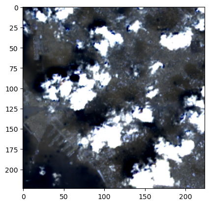
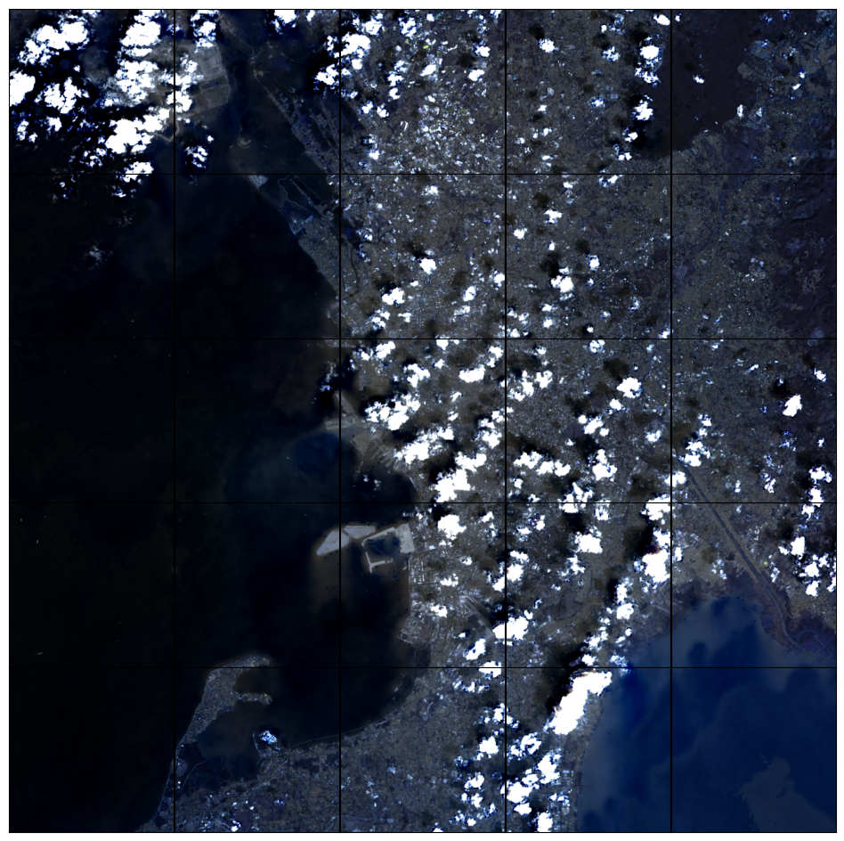
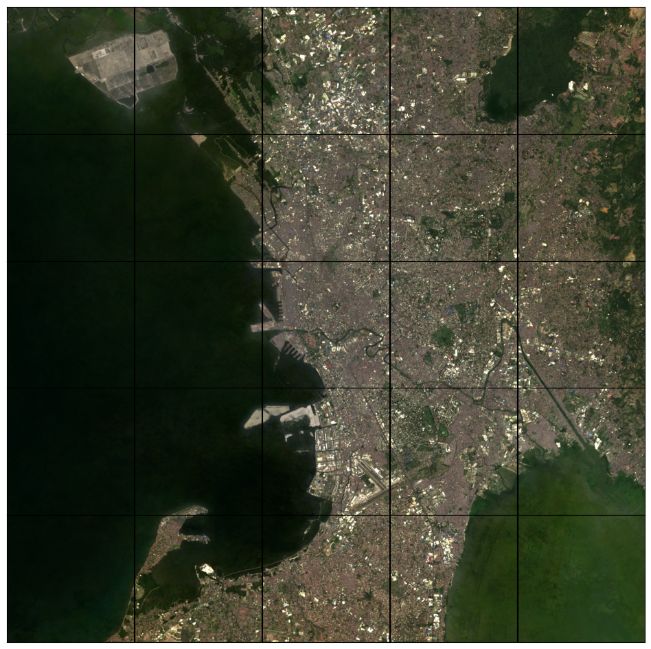

# ee-utils

A Python package for efficiently extracting satellite imagery patches from Google Earth Engine (GEE). This library provides high-level utilities for:

- **Patch Extraction**: Download georeferenced image patches centred on arbitrary coordinates
- **Neighbourhood Sampling**: Retrieve grids of contiguous patches around a point of interest
- **Parallel Downloads**: Concurrent requests via Earth Engine's high-volume API for rapid bulk exports
- **Multi-sensor Support**: Pre-configured data accessors for Landsat 4-9, Sentinel-2, and spatial covariates
- **Covariate Extraction**: Extract point-level values from climate, population, and land cover datasets

## Installation

Clone the repository and install:

```bash
git clone https://github.com/jordanimahori/ee-utils.git
cd ee-utils
python -m pip install .
```

**Requirements**: Python 3.10+, plus the dependencies listed in `pyproject.toml` (earthengine-api, numpy, pandas, matplotlib, pillow, requests, tqdm, pyproj).

For development (linting and tests):

```bash
python -m pip install -e ".[dev]"
```

## Package Layout

```
src/ee_utils/
├── geo.py                # CRS helpers (get_utm_epsg, wgs84_to_utm)
├── sampling.py           # Core extraction functions (get_patch, extract_patches, etc.)
├── viz.py                # Visualisation utilities (plot_neighbourhood, preview_patch)
└── imagery/
    ├── landsat.py        # LandsatSR: cloud-masked Landsat 4-9 composites
    ├── sentinel2.py      # Sentinel2SR: Cloud Score+ masked Sentinel-2 imagery
    └── covariates.py     # SpatialCovariates: climate, population, land cover layers
```

## Quick Start

The following examples demonstrate the core functionality of the package.


```python
import ee
import rasterio
import numpy as np
import matplotlib.pyplot as plt
from ee_utils import LandsatSR, get_neighbourhood, plot_neighbourhood, get_utm_epsg, extract_patches, get_patch
```


```python
# Image Patch Params
SCALE = 30                             # spatial resolution of export in meters: 30m/px
PATCH_SIZE = 224                       # patch diameter in pixels
```

### Authentication

Before using the package, authenticate with Google Earth Engine. If you haven't authenticated before, `ee.Authenticate()` will open a browser window for OAuth login.


```python
# Initialise using concurrency-optimised API route
ee.Authenticate()
ee.Initialize(opt_url='https://earthengine-highvolume.googleapis.com')
```

### CRS Helpers

The `get_utm_epsg()` function automatically determines the appropriate UTM zone for any WGS84 coordinate. This ensures patches are exported in a local projected CRS with minimal distortion.


```python
# Get EPSG code for UTM zone covering Manila
manila = (120.9842, 14.5995)
manila_crs = get_utm_epsg(manila)
```

## Extracting a Single Patch

The workhorse utility is `get_patch()`, which underlies most functions in this package. It provides a high-level wrapper around `ee.data.computePixels` (for computed `ee.Image` objects) or `ee.data.getPixels` (for Earth Engine Assets).

**Key features:**
- Works with both Asset IDs (e.g., `"LANDSAT/LC09/C02/T1_L2/LC09_116050_20240110"`) and computed `ee.Image` objects
- Automatic UTM projection when `patch_crs` is omitted
- Returns patch in requested format e.g. Numpy Array by default; GeoTIFF via `file_format="GEO_TIFF"`


```python
# Get patch around Manila
patch = get_patch(pt=manila, patch_crs=manila_crs, patch_size=224, patch_scale=30, asset_id="LANDSAT/LC09/C02/T1_L2/LC09_116050_20240110")

# Stack into RGB (H, W, 3); scale DNs to [0, 1]
rgb = np.stack([patch["SR_B1"], patch["SR_B2"], patch["SR_B3"]], axis=-1).astype("float32")
rgb = np.clip((rgb - 7300) / (18000 - 7300), 0, 1)

plt.imshow(rgb)
plt.show()
```


    

    


## Neighbourhood Extraction

This package also provides higher-level utilities that build on `get_patch()` to extract many patches. The `get_neighbourhood()` function fetches a grid of contiguous patches around a point.

**Parameters:**
- `levels`: Number of rings around the centre patch (e.g., `levels=2` gives a 5×5 grid of 25 patches)
- `concurrent_requests`: Number of parallel requests (default: 20)


```python
# Get image patches around Manila; visualise RGB bands.
asset_patches = get_neighbourhood(asset_id="LANDSAT/LC09/C02/T1_L2/LC09_116050_20240110", pt=manila, patch_scale=30, patch_crs=manila_crs, levels=2)
plot_neighbourhood(patches=asset_patches, levels=2, bands=["SR_B1", "SR_B2", "SR_B3"], vis_min=7300, vis_max=18000)
```


    

    


## Creating Cloud-Free Composites

As can be seen above, single-date imagery often contains clouds. To mitigate this, we can construct a temporal composite using the `LandsatSR` class.

### LandsatSR

The `LandsatSR` class provides a convenient interface for working with Landsat Collection 2 Level-2 Surface Reflectance data:

- **Multi-platform pooling**: Combines imagery from Landsat 4, 5, 7, 8, and 9 with harmonised band names
- **Cloud masking**: Automatic QA_PIXEL-based cloud and shadow masking
- **Band rescaling**: Optional rescaling to surface reflectance values (0-1 range)
- **Thermal band linking**: Joins thermal bands from TOA collections


```python
# Create median-composite for 2024 using all available Landsat imagery
landsat = LandsatSR(start_date=f"2024-01-01", end_date=f"2024-12-31", rescale_bands=False).images.median()
```


```python
# Extract patches in area around Manila; plot true-colour composite
patches = get_neighbourhood(image=landsat, pt=manila, patch_scale=30, patch_crs=manila_crs)
plot_neighbourhood(patches=patches, levels=2, bands=["RED", "GREEN", "BLUE"], vis_min=7300, vis_max=18000)
```


    

    


## Bulk Patch Export

For large-scale exports, use `extract_patches()` to download many patches in parallel and save them as GeoTIFFs:

**Parameters:**
- `pts`: List of (lon, lat) coordinates
- `patch_ids`: Unique identifiers for each patch (used as filenames)
- `output_dir`: Directory to save GeoTIFFs
- `concurrent_requests`: Number of parallel downloads (default: 40)
- `overwrite_patches`: If `False`, skip existing files (useful for resuming interrupted exports)

```python
# Create three-year (centred on survey year) median composite pooling Landsat 4-9
patch_centroids = [(120.9842, 14.5995), (139.6917, 35.6895), (103.8198, 1.3521), (116.4074, 39.9042)]
patch_ids = ["Manila", "Tokyo", "Singapore", "Beijing"]

# Extract patches from requested locations
extract_patches(image=landsat, pts=patch_centroids, patch_ids=patch_ids, patch_size=224, patch_scale=30,
                output_dir="docs/nb_outputs", overwrite_patches=True)

```


```python
with rasterio.open("nb_outputs/Beijing.tif") as f:
    patch = f.read()

patch[1, 0:10, 0:10]  # print 10x10 pixel extract

```


    array([[10834. , 10507. , 10316. , 10218. , 11693.5, 10884. , 10690.5,
            11272.5, 11341.5, 11262.5],
           [10795. , 10595. , 10250. , 11163. , 11645.5, 11067. , 11061.5,
            11251.5, 11561.5, 11290. ],
           [10844. , 11328. , 10871. , 10897. , 10629. , 10535.5, 10864. ,
            10972. , 11051. , 11012.5],
           [11045. , 11094. , 11159. , 10540. , 10661. , 10594. , 10707. ,
            10867.5, 10922. , 10723. ],
           [11133. , 10642. , 12187. , 11552. , 10968. , 11136. , 10635. ,
            10732. , 11045.5, 10937. ],
           [11202. , 10533. , 11080. , 10503. , 10772. , 10863.5, 10353. ,
            10948. , 11043. , 10851. ],
           [11333. , 10982. , 10048. ,  9652. ,  9681. ,  9751. , 10253.5,
            10992.5, 10988.5, 10825. ],
           [11433. , 11820. , 10808. , 10218. ,  9781. ,  9943.5, 10228. ,
            10489.5, 10744.5, 10194.5],
           [11448. , 11562. , 11967. , 10737. ,  9654. ,  9772. ,  9889. ,
            10573.5, 11025. , 10512. ],
           [11774. , 13165. , 12630. , 10550. , 10097. , 10244. , 10406. ,
            11055.5, 12191. , 12293. ]])


## Additional Features

### Sentinel-2 Support

The `Sentinel2SR` class provides similar functionality for Sentinel-2 imagery with Cloud Score+ masking:

```python
from ee_utils import Sentinel2SR

s2 = Sentinel2SR(
    start_date="2024-01-01",
    end_date="2024-12-31",
    bands=["B2", "B3", "B4", "B8"],  # Blue, Green, Red, NIR
    clear_threshold=0.60  # Cloud Score+ threshold
)
composite = s2.images.median()
```

### Spatial Covariates

The `SpatialCovariates` class and `extract_spatial_covariates()` function enable extraction of point-level covariate values from multiple Earth Engine datasets:

- **TerraClimate**: Temperature (min/max)
- **CHIRPS**: Precipitation
- **VIIRS**: Nighttime lights
- **GHS**: Population and built-up area (JRC Global Human Settlement Layer)
- **Dynamic World**: Land cover probabilities
- **OpenLandMap**: Soil pH

```python
from ee_utils import SpatialCovariates, extract_spatial_covariates

covariates = SpatialCovariates(year=2024)
df = extract_spatial_covariates(
    image=covariates.all_covariates_comp,
    pts=[(120.98, 14.60), (139.69, 35.69)],
    patch_ids=["Manila", "Tokyo"],
    patch_scale=1000
)
```


## API Reference

### Core Functions

| Function | Description |
|----------|-------------|
| `get_patch()` | Extract a single patch as NumPy array or GeoTIFF |
| `get_neighbourhood()` | Extract a grid of contiguous patches |
| `extract_patches()` | Bulk export patches to GeoTIFF files |
| `extract_spatial_covariates()` | Extract point values as a DataFrame |

### CRS Utilities

| Function | Description |
|----------|-------------|
| `get_utm_epsg()` | Get UTM EPSG code for a WGS84 coordinate |
| `wgs84_to_utm()` | Convert WGS84 to UTM coordinates |

### Data Accessors

| Class | Description |
|-------|-------------|
| `LandsatSR` | Cloud-masked Landsat 4-9 Collection 2 Level-2 imagery |
| `Sentinel2SR` | Cloud Score+ masked Sentinel-2 Harmonized imagery |
| `SpatialCovariates` | Annual composite covariate layers |

## License

MIT License.


```python

```
